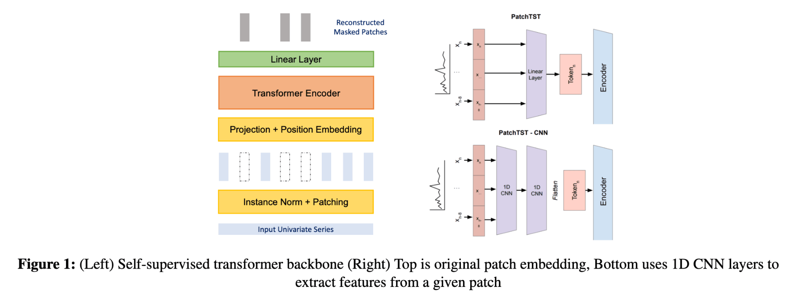
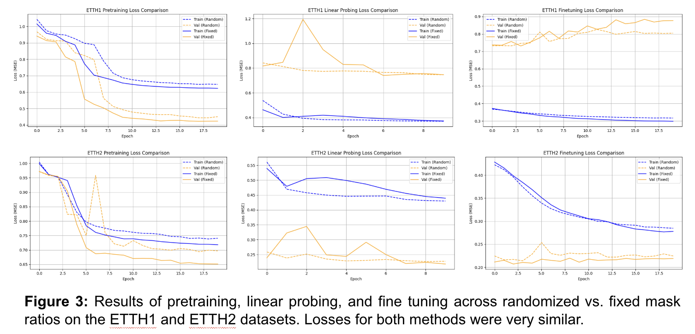
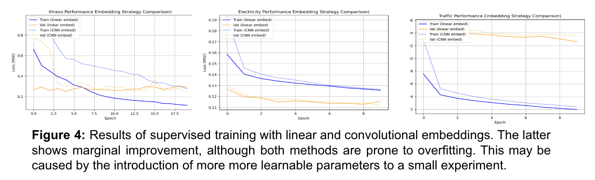

# CS4782 (Deep Learning) Final Project

CS4782 Deep Learning, Cornell University, Spring 2025 

Angela Cui (ayc62), Vipin Gunda (vg245), James Kim (jjk297), Derek Liu (dtl54), Oliver Lopez (ojl23)

## Introduction
This is a project that attempts to re-implement [A Time Series is Worth 64 Words: Long-term Forecasting with Transformers](https://arxiv.org/abs/2211.14730). Transformers face limitations when applied to time series data forecasting, because their self-attention mechanism scales quadratically with sequence length, restricting the model’s ability to learn long-range dependencies efficiently. To address this, the authors propose PatchTST, a Transformer-based model tailored for multivariate time series and self-supervised representation learning based on patching and channel independence, which involves dividing time series into subseries-level patches to capture local semantic information while reducing sequence length and processing each univariate time series separately with shared weights, respectively.

## Chosen Result
Our project focused on reproducing and extending two specific components of the original paper: 
1) Randomized Mask Ratios in Self-Supervised Learning 
The self-supervised PatchTST model masks a fixed percentage of patches during pretraining. We explored whether randomizing the mask ratio would encourage robustness and prevent overfitting to a fixed masking pattern. Our hypothesis was that this would yield a stronger self-supervised representation, more adaptable for downstream tasks like forecasting. 
2) Improved Patch Embeddings via 1D Convolutions 
In the original architecture, each patch is embedded using a linear projection. We hypothesized that replacing this linear layer with convolutional layers could improve performance by better capturing local temporal dependencies within each patch. Working off the fact that CNNs work well for images, we reasoned that by convolving before flattening, the model may gain richer semantic information, potentially improving both representation quality and downstream forecasting accuracy.


## GitHub Contents
All of the code is in the [Code Folder](https://github.com/biojameskim/timeseries-transformer/tree/main/code). We split it up into two folders:

1) PatchTST_self_supervised contains pre-training and fine-tuning scripts for the PatchTST model, including the randomized mask ratio. 

2) embed_notes includes code for embedding time series data. This folder includes the 1D convolutional patch embeddings improvements. 

## Re-implementation Details

### Self-supervised Experiment with Masking Ratio
We implemented an extension to the [PatchTST self-supervised model](https://github.com/yuqinie98/PatchTST/tree/204c21efe0b39603ad6e2ca640ef5896646ab1a9) which uses a randomized mask ratio between 0.2 and 0.6 during each forward pass. For every batch, a new mask ratio was uniformly sampled from this range and used to randomly select a proportion of patch embeddings to be masked. These masked patches were then replaced with learnable mask tokens, and the model was trained to reconstruct the original values. Aside from this randomized masking strategy, all other aspects of the pretraining and evaluation process—such as loss functions, optimizer settings, and downstream fine-tuning—remained consistent with the original PatchTST setup. Since the task was to reconstruct the missing patches, no attention rescaling or architectural modifications were required. We evaluated the MSE, MAE, and training and validation losses using the ETTH1 and ETTH2 datasets. 

### Context Window and Transformer Architecture
Due to computational resource constraints, we used a smaller context window and a reduced-size Transformer architecture. While this scaled-down model is supported by the original paper for ablation studies and efficiency comparisons, the full model is used in the paper to achieve state-of-the-art results. Similarly, we trained for a limited number of epochs—20 for pretraining, 10 for linear probing, and 20 for full fine-tuning—whereas the original paper trains on the order of 100 epochs. Our goal was to evaluate the effects of randomized masking rather than to reproduce the highest possible benchmark performance.

### Embedding Strategy
Similarly, our investigation of the embedding strategy largely followed the existing structure from [2]. We used the same Transformer architecture across experiments (after reinitializing the weights) in order to compare the effectiveness against a consistent baseline. The model was trained from scratch on each dataset using a linear layer, as in the original paper, and then trained from scratch with two convolutional layers. We used a fixed kernel_size of 3 with a hidden layer of 8 channels, and an output layer of 32 channels. ReLu was applied to the activations of each layer. While this is only a small subset of reasonable configurations, we were not able to explore other options since full experiments could take several hours.

## Reproduction Steps

### Self-Supervised Experiment with Masking Ratio
First, install the requirements. 

```bash
% cd code/PatchTST_self_supervised
% pip install -r requirements.txt
```

The datasets ``etth1`` and ``etth2`` are already downloaded in ``code/PatchTST_self_supervised/saved_models/`` from  [Autoformer](https://drive.google.com/drive/folders/1ZOYpTUa82_jCcxIdTmyr0LXQfvaM9vIy). Run the following script, which performs pretraining and finetuning with both fixed mask ratio and random mask ratio on the ``etth1`` and ``etth2`` datasets:

```bash
% ./script.sh
```

The script output will be dumped in ``code/PatchTST_self_supervised/run.logs``. The performance of the model will be in ``code/PatchTST_self_supervised/saved_models/etth2/masked_patchtst/based_model`` and ``code/PatchTST_self_supervised/saved_models/etth1/masked_patchtst/based_model``. The data for fixed mask ratio experiments is dumped in the csv files labeled with ``model1`` and the data for random mask ratio experiments is dumped in files labeled ``model2``.

## Results/Insights




## Conclusion
1) Randomized mask ratios do not yield significant improvements in long-term time series forecasting performance. In some cases, randomization slightly worsens results, though the differences are likely negligible.
2) Augmenting the PatchTST architecture with 1D convolutional layers (as shown in Figure 2) does not provide meaningful performance gains, and is still prone to overfitting.
3) These results suggest that the original patch-based linear embedding is already sufficiently expressive for the task, and further architectural complexity yields diminishing returns.

## References
[1] G. L. Asher, “Exploring Tokenization Techniques to Optimize Patch-Based Time-Series Transformers,” Computer Science Senior Theses, no. 47, Dartmouth College, 2024. [Online]. Available: https://digitalcommons.dartmouth.edu/cs_senior_theses/47 

[2] Y. Nie, N. H. Nguyen, P. Sinthong, and J. Kalagnanam, “A Time Series is Worth 64 Words: Long-term Forecasting with Transformers,” in Proc. Int. Conf. Learn. Representations (ICLR), 2023.

## Acknowledgements
Credits to Autoformer for the [Time Series Dataset](https://drive.google.com/drive/folders/1ZOYpTUa82_jCcxIdTmyr0LXQfvaM9vIy), and to the Cornell CS4782 Course staff for providing the [Time Series Paper](https://arxiv.org/abs/2211.14730) to complete this project as part of Intro to Deep Learning.